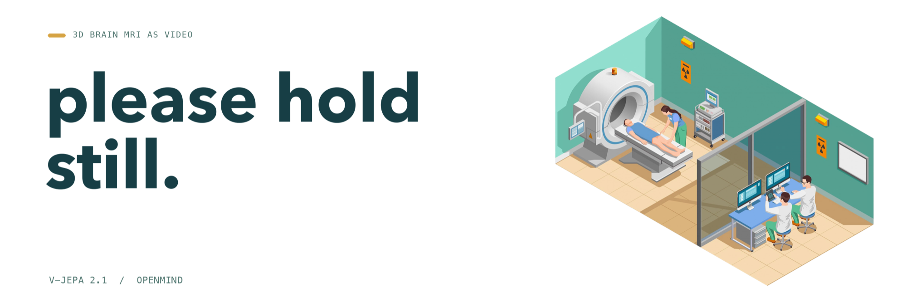
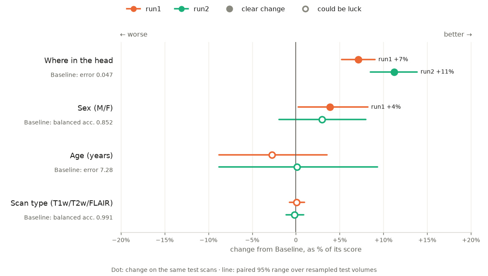

# please-hold-still

Continued self-supervised pretraining of Meta's V-JEPA 2.1 video encoder on 3D
brain MRI (the OpenMind dataset), treating consecutive axial slices as video
frames.



## Results

### run2: 2000 steps on 1992 volumes

2000 steps on the 1644 training volumes (ViT-B, batch 8, fp32, about 1.8 h on
Apple silicon). Linear probes on the frozen encoder, scored on 348 held-out
scans from studies never used in training.

Baseline is the original V-JEPA 2.1 ViT-B. run1 is the encoder from the
earlier 200-volume run (below), re-scored on this set. The run1 and run2
columns show the change from the baseline, with a paired 95% bootstrap range
in brackets: both models answer the same test scans, and whole volumes are
resampled. **Bold** means the range excludes 0.

| Task | Chance | Baseline | run1 | run2 |
|---|---|---|---|---|
| Slice height, MAE ↓ | 0.26 | 0.047 | **−0.003** [−0.004, −0.002] | **−0.005** [−0.007, −0.004] |
| Sex (M/F), balanced acc. ↑ | 0.50 | 0.852 | **+0.033** [+0.002, +0.070] | +0.025 [−0.017, +0.068] |
| Age, MAE years ↓ | 11.3 | 7.28 | +0.20 [−0.26, +0.64] | −0.01 [−0.68, +0.64] |
| Scan type, balanced acc. ↑ | 0.33 | 0.991 | +0.001 [−0.007, +0.010] | −0.002 [−0.011, +0.009] |

Continued pretraining clearly improves where-in-the-head: run2's error is
about 11% lower than the baseline's, and lower than run1's too (−0.002
[−0.003, −0.001]). Age shows no clear change, and scan type is already at
ceiling. run1's gain on sex is marginal and does not hold in run2. The ranges
cover test-set sampling only; each setting was trained once.

The chart shows the same changes as a percentage of the baseline's score,
turned so that right is always better (less error, or higher accuracy). A
filled dot is a bold entry in the table; a hollow dot could be luck.



### run1 on 200 volumes (superseded)

1000 steps on 200 volumes, 46 min, scored on 33 held-out scans: scan type
0.91 → 0.97, sex 0.79 → 0.79, age MAE 9.8 → 8.5 years, slice height 0.062 →
0.059. Every 95% range overlapped the baseline's. On the 348-scan test set
above, only the slice-height gain holds clearly, and the age gain turned out
to be test-set luck.

<details>
<summary>run1 chart (33 test scans)</summary>


</details>

## Setup (Mac)

```bash
# once: install uv  →  https://docs.astral.sh/uv/getting-started/installation/
uv sync          # creates .venv/ and installs the exact versions in uv.lock
uv run pytest    # should print only dots and "passed"
```

Large files (downloads, preprocessed volumes, checkpoints) go under one data
folder, ideally on an external drive. Point the code at it with
`export PLEASE_HOLD_STILL_DATA=/path/to/folder` (add that line to `~/.zshrc`
so every terminal has it).

See `CLAUDE.md` for conventions and the full command list.

## License

The code in this repo is licensed under [Apache 2.0](LICENSE). The license
covers that code only. No rights are claimed to the model or data below. They
belong to their owners, keep their own licenses, and are not stored here:

- [V-JEPA 2.1](https://github.com/facebookresearch/vjepa2) code and weights,
  by Meta: MIT.
- [OpenMind dataset](https://huggingface.co/datasets/MIC-DKFZ/OpenMind):
  CC BY 4.0. Built from OpenNeuro studies, each under its own terms.
