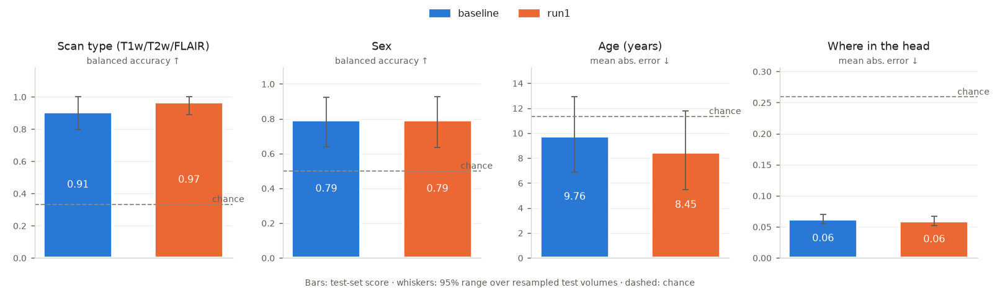

# mri-jepa

Continued self-supervised pretraining of Meta's V-JEPA 2.1 video encoder on 3D
brain MRI (the OpenMind dataset), treating consecutive axial slices as video
frames.

## Results: run1

1000 steps on 200 volumes (ViT-B, batch 8, 46 min on Apple silicon). Loss
0.76 → 0.45. Linear probes on the frozen encoder, 33 held-out scans:

| Task | Chance | Baseline | run1 |
|---|---|---|---|
| Scan type, balanced acc. ↑ | 0.33 | 0.91 | 0.97 |
| Sex, balanced acc. ↑ | 0.50 | 0.79 | 0.79 |
| Age, MAE years ↓ | 11.4 | 9.8 | 8.5 |
| Slice height, MAE ↓ | 0.26 | 0.062 | 0.059 |

Baseline is the original V-JEPA 2.1 ViT-B. Three scores improve and one holds,
but every 95% range overlaps the baseline's, so none of the gains is
significant yet.



## Setup (Mac)

```bash
# once: install uv  →  https://docs.astral.sh/uv/getting-started/installation/
uv sync          # creates .venv/ and installs the exact versions in uv.lock
uv run pytest    # should print only dots and "passed"
```

Large files (downloads, preprocessed volumes, checkpoints) go under one data
folder, ideally on an external drive. Point the code at it with
`export MRI_JEPA_DATA=/path/to/folder` (add that line to `~/.zshrc` so every
terminal has it).

See `CLAUDE.md` for conventions and the full command list.

## License

The code in this repo is licensed under [Apache 2.0](LICENSE). The license
covers that code only. No rights are claimed to the model or data below. They
belong to their owners, keep their own licenses, and are not stored here:

- [V-JEPA 2.1](https://github.com/facebookresearch/vjepa2) code and weights,
  by Meta: MIT.
- [OpenMind dataset](https://huggingface.co/datasets/MIC-DKFZ/OpenMind):
  CC BY 4.0. Built from OpenNeuro studies, each under its own terms.
